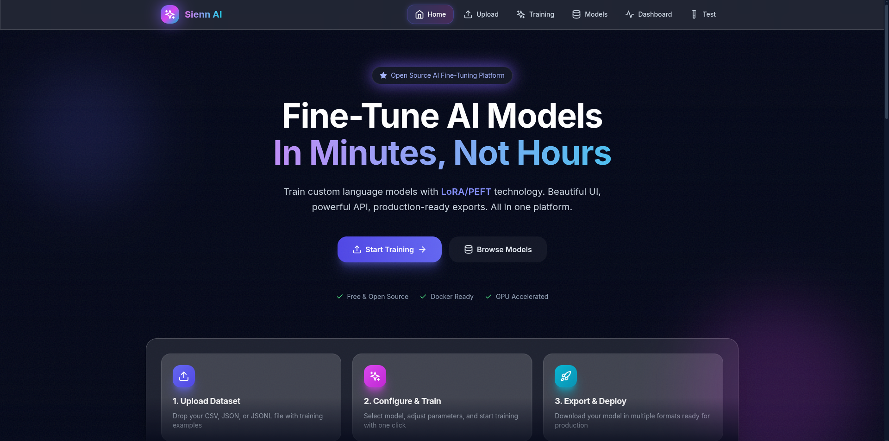

# Sienn-AI

<div align="center">

**Production-ready platform for fine-tuning large language models with LoRA**

[](LICENSE)
[](https://www.python.org/downloads/)
[](https://www.docker.com/)

[Features](#-features) • [Quick Start](#-quick-start) • [Documentation](#-documentation) • [Contributing](#-contributing)

</div>

---

## 📸 Interface Preview

<div align="center">
  
  <p><i>Sienn-AI Web Interface - Model Training Dashboard</i></p>
</div>

---

## Overview

Sienn-AI is a complete platform for fine-tuning large language models using **LoRA (Low-Rank Adaptation)**. It provides an intuitive web interface and REST API for training, testing, and exporting AI models efficiently.

**Key Benefits:**
- **Efficient** - Train only 0.1% of parameters with LoRA, 10x faster than full fine-tuning
- **User-Friendly** - Web interface with real-time monitoring and progress tracking
- **Flexible** - Support for Qwen, GPT-2, Phi, and custom HuggingFace models
- **Production-Ready** - Docker deployment, async processing, multiple export formats

---

## 🎯 Features

**Training & Inference**
- Upload datasets (CSV, JSON, JSONL) with automatic validation
- Fine-tune models with configurable LoRA parameters
- Real-time training progress and metrics monitoring
- Interactive model testing with custom prompts
- Export to multiple formats (PyTorch, Ollama, HuggingFace)

**Technical Stack**
- **Backend**: FastAPI, Celery, Redis, SQLite, MinIO
- **Frontend**: React 18, TypeScript, TailwindCSS, Vite
- **ML**: Transformers, PEFT (LoRA), PyTorch
- **DevOps**: Docker Compose, automated builds

---

## 🚀 Quick Start

### Prerequisites

- Docker & Docker Compose installed
- 8GB RAM minimum (16GB recommended)
- Optional: NVIDIA GPU for faster training

### Installation

```bash
# Clone repository
git clone https://github.com/doriansenecot/Sienn-AI.git
cd Sienn-AI

# Start services
docker compose up -d

# Access application
# Web UI:   http://localhost:3000
# API:      http://localhost:8000
# API Docs: http://localhost:8000/docs
```

### Usage Example

```bash
# 1. Upload dataset
curl -X POST http://localhost:8000/api/upload-dataset \
  -F "file=@dataset.csv"

# 2. Start training
curl -X POST http://localhost:8000/api/start-finetuning \
  -H "Content-Type: application/json" \
  -d '{
    "dataset_id": "your-dataset-id",
    "model_name": "Qwen/Qwen2.5-0.5B-Instruct",
    "num_epochs": 3
  }'

# 3. Monitor progress
curl http://localhost:8000/api/training-status/{job-id}

# 4. Test model
curl -X POST http://localhost:8000/api/test-model \
  -H "Content-Type: application/json" \
  -d '{
    "job_id": "your-job-id",
    "prompt": "What is Python?"
  }'
```

**Or use the web interface** at http://localhost:3000 for a guided experience.

---

## 📚 Documentation

| Document | Description |
|----------|-------------|
| **[User Guide](docs/USER_GUIDE.md)** | Complete walkthrough from dataset to deployment |
| **[API Documentation](docs/API_DOCUMENTATION.md)** | Full API reference with examples |
| **[Installation Guide](docs/INSTALLATION.md)** | Detailed setup instructions |
| **[Quick Start](docs/QUICKSTART.md)** | 5-minute getting started guide |
| **[FAQ](docs/FAQ.md)** | Frequently asked questions |

---

## 🏗️ Architecture

```
┌──────────┐      ┌──────────┐      ┌──────────┐
│ Frontend │─────▶│   API    │─────▶│  Worker  │
│  React   │      │ FastAPI  │      │  Celery  │
└──────────┘      └──────────┘      └──────────┘
                       │  │              │
                       │  │              │
                   ┌───┘  └────┐         │
                   ▼           ▼         ▼
              ┌────────┐  ┌────────┐  ┌────────┐
              │ Redis  │  │ SQLite │  │ MinIO  │
              │ Queue  │  │  Jobs  │  │ Models │
              └────────┘  └────────┘  └────────┘
```

**Stack**
- **API**: FastAPI, Python 3.9+
- **Worker**: Celery, Transformers, PEFT
- **Frontend**: React 18, TypeScript, TailwindCSS
- **Storage**: SQLite (metadata), MinIO (models), Redis (queue)
- **Deployment**: Docker Compose

---

## 🤖 Supported Models

| Model | Size | VRAM | Use Case |
|-------|------|------|----------|
| **Qwen 2.5 0.5B** | 500M | 2GB | Fast experimentation |
| **Qwen 2.5 1.5B** | 1.5B | 4GB | General purpose |
| **Qwen 2.5 3B** | 3B | 8GB | High quality |
| **Qwen 2.5 7B** | 7B | 16GB | Production |

All HuggingFace models compatible with PEFT are supported. See [User Guide](docs/USER_GUIDE.md) for details.

---

## Development

### Local Setup

```bash
# Backend
cd backend
python -m venv .venv
source .venv/bin/activate  # Windows: .venv\Scripts\activate
pip install -r requirements.txt

# Frontend
cd frontend
npm install
npm run dev
```

### Useful Commands

```bash
make help          # Show all available commands
make dev           # Start development environment
make logs          # View all logs
make lint          # Check code quality
make lint-fix      # Fix linting issues
make clean         # Clean build artifacts
```


---

## License

MIT License - see [LICENSE](LICENSE) for details.

---

## Support

- **Documentation**: [docs/](docs/)

---

<div align="center">

**⭐ Star this repository if you find it useful!**

Made by [@doriansenecot](https://github.com/doriansenecot)

</div>
